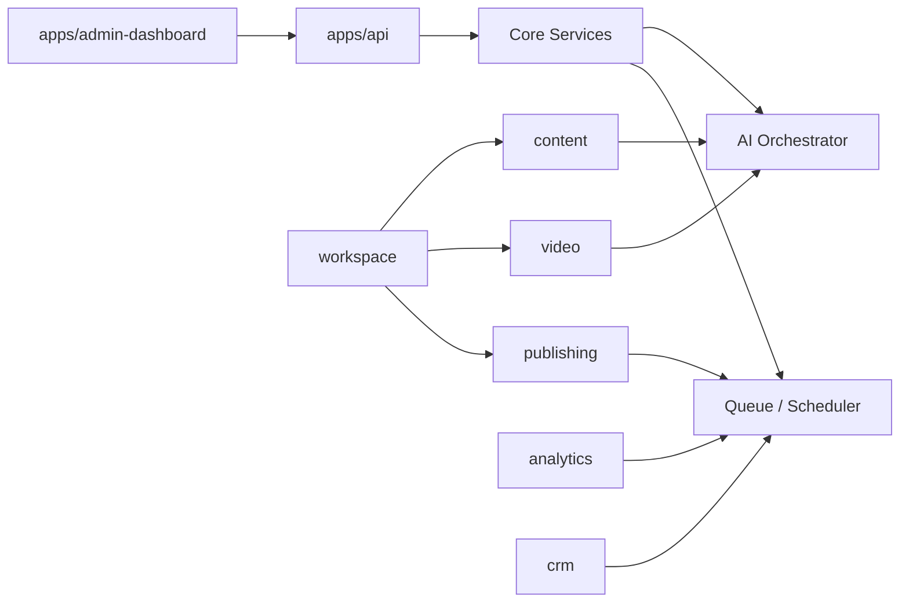
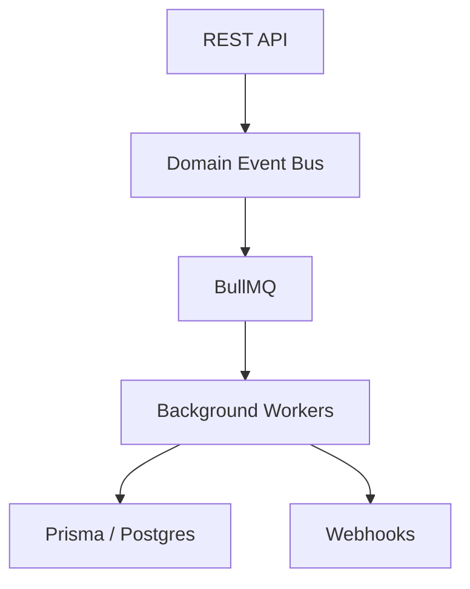
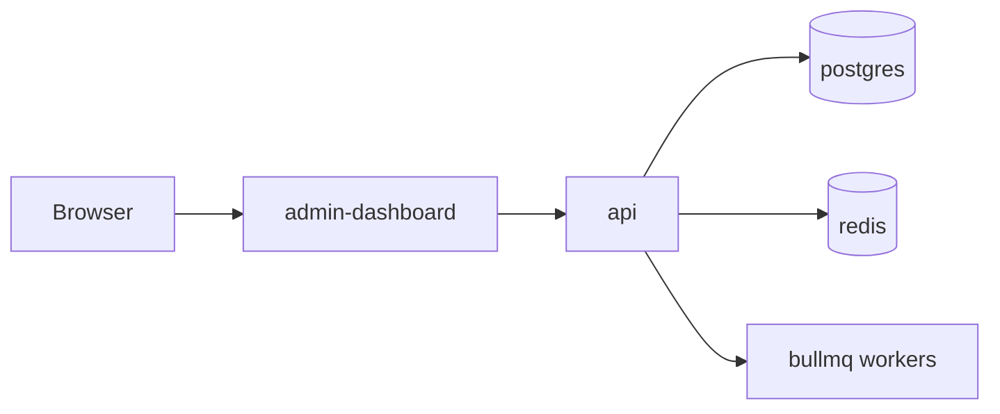

# AI-VIDIO Core Architecture

## Goals

- Modular SaaS architecture
- Multi-workspace, multi-brand, multi-account
- Plug-in style modules with shared contracts
- Unified API, database, queue, and event conventions
- Separate development of content, video, publishing, analytics, funnel, crm, and AI

## Monorepo Layout

```text
apps/
  admin-dashboard/
  api/
packages/
  ui/
  config/
  types/
  utils/
```

## Domain Modules

- `content`: script and copy generation
- `video`: script-to-video rendering
- `publishing`: multi-platform publishing
- `analytics`: metrics ingestion and optimization
- `funnel`: landing, offer, and conversion flow
- `crm`: leads, conversations, follow-up, and pipeline
- `ai`: prompt orchestration, model routing, style control, and cost control
- `auth`: identity, OAuth, sessions, tokens
- `users`: user profile and membership
- `workspace`: multi-tenant workspace and brand isolation
- `integrations`: external service adapters
- `queue`: BullMQ job orchestration
- `scheduler`: cron and delayed task coordination

## Module Composition



## Service-to-Service Rules

- Prefer direct service calls inside the same bounded context
- Cross-module calls go through public interfaces only
- Long-running work uses queue jobs, not synchronous blocking
- Shared contracts live in `packages/types`

## Event-Driven Layer



- Use domain events for state changes
- Use BullMQ for long-running and retryable jobs
- Use webhooks for external state changes coming back from platforms

## Queue Strategy

- `video-rendering`
- `publishing`
- `metrics-sync`
- `follow-up`

## AI Orchestrator

- One entry point for all AI calls
- Standard prompt templates and tone controls
- Cost tracking by workspace, brand, and module
- Provider routing and fallback
- Shared output normalization for content, video, and crm

## Prisma Core Tables

- `users`
- `workspaces`
- `brands`
- `products`
- `contents`
- `videos`
- `platform_accounts`
- `publishing_jobs`
- `metrics`
- `leads`
- `conversations`

## API Contract

- RESTful endpoints
- Unified response envelope
- Standard pagination
- Standard error format

## Environment Layers

- `dev`
- `staging`
- `production`

## Docker Topology



